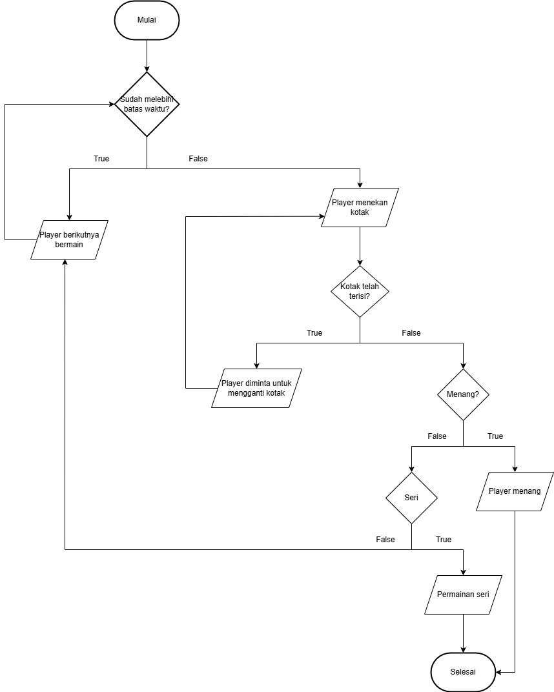

  <h2 align="center">
    Tic Tac Toe
  </h2>

<!-- Daftar Isi -->

  
<h2 style="display: inline-block">Daftar Isi</h2>

  <ol>
    <li><a href="#anggota-tim">Anggota Tim</a></li>
    <li><a href="#latar-belakang">Latar Belakang</a></li>
    <li><a href="#tujuan-dan-manfaat">Tujuan dan Manfaat</a></li>
    <li><a href="#penjelasan-aplikasi">Penjelasan Program</a></li>
    <li><a href="#change-log">Change Log</a></li>
    <li><a href="#diagram-alir-program">Diagram Alir Program</a></li>
    <li><a href="#bahasa-yang-digunakan">Bahasa yang Digunakan</a></li>
    <li><a href="#gambar-rancangan-antarmuka">Gambar Rancangan Antarmuka</a></li>
    <li><a href="#lisensi">Lisensi</a></li>
  </ol>

<!-- Anggota Tim -->
## Anggota Tim
| NPM           | Name                        |
| ------------- | --------------------------- |
| 140810230064  | Alissa Indraputri           |
| 140810230066  | Hanna Evelyn Gultom         |

<!-- Latar Belakang -->
## Latar Belakang

Dalam era digital saat ini, teknologi telah memberikan kemajuan yang pesat terhadap dunia permainan atau game. Beberapa permainan yang dapat dimainkan melalui beberapa media, seperti kertas, kartu, dll. sudah bisa diprogram dengan bahasa pemrograman, sehingga mereka dapat dimainkan di komputer pribadi, telepon genggam atau handphone, maupun konsol. Oleh karenanya, dunia permainan dapat berinovasi dengan pesat di era teknologi yang terus berkembang dengan pesat.

<!-- Tujuan dan Manfaat -->
## Tujuan dan Manfaat

Tujuan dari permainan Tic-Tac-Toe adalah meningkatkan sportivitas dalam bermain dan mengembangkan keterampilan dalam memecahkan suatu masalah.

Manfaat game Tic-Tac-Toe:
1. Mengembangkan keterampilan pemecahan masalah.
2. Mengajarkan kesabaran (dan bergiliran).
3. Memacu pengembangan keterampilan motorik halus dan koordinasi.
4. Mengajarkan pentingnya aturan.
5. Meningkatkan respon sistem imun (bermain game dengan orang lain).
6. Mengajarkan keterampilan strategi.
7. Mengembangkan pemikiran logis.
8. Meningkatkan kemampuan konsentrasi dan fokus.
9. Mengajarkan sportivitas yang baik.
10. Mengembangkan keterampilan pemecahan masalah.

<!-- Penjelasan Program -->
## Penjelasan Program

Tic-Tac-Toe adalah permainan papan yang dimainkan oleh dua orang di papan berpetak 3x3, di mana salah satu pemain menjadi "X" dan yang lain menjadi "O" secara bergantian. Kedua pemain akan menekan papan tersebut saat gilirannya tiba. Pemenang dari permainan ini adalah membuat deretan X atau O secara vertikal, horizontal, ataupun diagonal, contoh XXX atau OOO.

## Change log
- **[Sprint Planning](changelog/sprint-planning.md) - (date)** 
   - Membuat home page               
   - Membuat information page        
   - Membuat database NoSQL 
   - Membuat tampilan dasar game page                
   - Memakai React di Home page dan Information page 
   - Mengintegrasi nama user ke database             
   - Logika game

- **[Sprint 1](changelog/sprint-1.md) - (date from 8 January 2025 until 15 January 2025)** 
   - Membuat home page               
   - Membuat information page        
   - Membuat database NoSQL 

- **[Sprint 2](changelog/sprint-2.md) - (date from 16 January 2025 until 23 January 2025)** 
   - Membuat tampilan dasar game page                
   - Memakai React di Home page dan Information page 
   - Mengintegrasi nama user ke database             
   - Logika game 

- **[Sprint 3](changelog/sprint-3.md) - (date from 27 January 2025 until 3 February 2025)** 
   - Mengintegrasi nama user ke database
   - Membuat timer, poin, dan tampilan setting

- **[Sprint 4](changelog/sprint-4.md) - (date from 6 February 2025 until 13 February 2025)** 
   - Membuat save and load state
   - Mengubah struktur dokumen JSON
   - Membuat alert jika nama tidak terisi

- **[Sprint 4 Extended](changelog/sprint-4-extended.md) - (date from 14 February 2025 until 16 February 2025)** 
   - Memperbaiki load state
   - Menambah animasi di scoring

<!-- Bahasa yang digunakan -->
## Bahasa yang digunakan

Bahasa yang digunakan dalam proyek ini:
- Frontend: HTML/CSS, Javascript
- Backend: Flask, MongoDB

<!-- Diagram Alir Program -->
## Diagram Alir Program

Sumber gambar: https://dev.to/shakyapeiris/the-logic-behind-tic-tac-toe-game-32f9 

<!-- Gambar Rancangan Antarmuka -->
## Gambar Rancangan Antarmuka
https://www.figma.com/design/yNMLTb3nObNnsTV9FDV79f/Tic-tac-toe?node-id=0-1&m=dev

<!-- Lisensi -->
## Lisensi

MIT License 2024